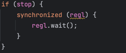

Escuela Colombiana de Ingeniería

Arquitecturas de Software – ARSW

#### Taller – programación concurrente, condiciones de carrera y sincronización de hilos. EJERCICIO INDIVIDUAL O EN PAREJAS.

##### Santiago Arévalo Rojas
##### Juan Felipe Sánchez Pérez

##### Parte I – Antes de terminar la clase.

Creación, puesta en marcha y coordinación de hilos.

<strong>

1. Revise el programa “primos concurrentes” (en la carpeta parte1), dispuesto en el paquete edu.eci.arsw.primefinder. Este es un programa que calcula los números primos entre dos intervalos, distribuyendo la búsqueda de los mismos entre hilos independientes. Por ahora, tiene un único hilo de ejecución que busca los primos entre 0 y 30.000.000. Ejecútelo, abra el administrador de procesos del sistema operativo, y verifique cuantos núcleos son usados por el mismo.  

</strong>

* En este caso, se evidencia un uso del 94% de la CPU, viendo en todas las gráficas de cada uno de los 8 núcelos un pico que indica que están trabajando y empleando recursos para cumplir con lo que requiere el hilo creado.

<strong>

2. Modifique el programa para que, en lugar de resolver el problema con un solo hilo, lo haga con tres, donde cada uno de éstos hará la tarcera parte del problema original. Verifique nuevamente el funcionamiento, y nuevamente revise el uso de los núcleos del equipo.

</strong> 

* Nuevamente se evidencia que trabajan todos los núcelos del procesador cuando se crean tres hilos para realizar la tarea.

<strong>

3. Lo que se le ha pedido es: debe modificar la aplicación de manera que cuando hayan transcurrido 5 segundos desde que se inició la ejecución, se detengan todos los hilos y se muestre el número de primos encontrados hasta el momento. Luego, se debe esperar a que el usuario presione ENTER para reanudar la ejecución de los mismo.

</strong> 

* La implementación se encuentra en el código.

##### Parte II 

Para este ejercicio se va a trabajar con un simulador de carreras de galgos (carpeta parte2), cuya representación gráfica corresponde a la siguiente figura:

En la simulación, todos los galgos tienen la misma velocidad (a nivel de programación), por lo que el galgo ganador será aquel que (por cuestiones del azar) haya sido más beneficiado por el *scheduling* del
procesador (es decir, al que más ciclos de CPU se le haya otorgado durante la carrera). El modelo de la aplicación es el siguiente:

Como se observa, los galgos son objetos ‘hilo’ (Thread), y el avance de los mismos es visualizado en la clase Canodromo, que es básicamente un formulario Swing. Todos los galgos (por defecto son 17 galgos corriendo en una pista de 100 metros) comparten el acceso a un objeto de tipo
RegistroLLegada. Cuando un galgo llega a la meta, accede al contador ubicado en dicho objeto (cuyo valor inicial es 1), y toma dicho valor como su posición de llegada, y luego lo incrementa en 1. El galgo que
logre tomar el ‘1’ será el ganador.

Al iniciar la aplicación, hay un primer error evidente: los resultados (total recorrido y número del galgo ganador) son mostrados antes de que finalice la carrera como tal. Sin embargo, es posible que una vez corregido esto, haya más inconsistencias causadas por la presencia de condiciones de carrera.

Taller.

<strong>

1.  Corrija la aplicación para que el aviso de resultados se muestre
    sólo cuando la ejecución de todos los hilos ‘galgo’ haya finalizado.
    Para esto tenga en cuenta:

    a.  La acción de iniciar la carrera y mostrar los resultados se realiza a partir de la línea 38 de MainCanodromo.

    b.  Puede utilizarse el método join() de la clase Thread para sincronizar el hilo que inicia la carrera, con la finalización de los hilos de los galgos.

</strong>

* Antes de iniciar la carrera, ya no se evidencia la aparición del diálogo diciendo quien es el ganador:

* Aplicando el método join() sobre los hilos para esperar a que terminen su ejecución, arreglamos el problema. En este caso, el ganador fue el galgo 1:

<strong>

2.  Una vez corregido el problema inicial, corra la aplicación varias
    veces, e identifique las inconsistencias en los resultados de las
    mismas viendo el ‘ranking’ mostrado en consola (algunas veces
    podrían salir resultados válidos, pero en otros se pueden presentar
    dichas inconsistencias). A partir de esto, identifique las regiones
    críticas () del programa.

</strong>

* Se observa una inconsistencia en el orden en que se muestra el resultado, apareciendo primero la posición 6 que la 5, por ejemplo:

* Además, en ocasiones aparecen 16 corredores y no 17:

* Cuando observamos el ranking en la consola, pudimos notar que dos galgos ocuparon la segunda posición, lo cual podría haber ocurrido debido a un empate:

* Teniendo esto en cuenta, la región crítica es aquella donde los hilos consultan y modifican la variable que indica el orden de llegada:

<strong>

3.  Utilice un mecanismo de sincronización para garantizar que a dichas
    regiones críticas sólo acceda un hilo a la vez. Verifique los
    resultados.

</strong>

* En este caso, usamos el mecanismo de bloques sincronizados sobre la región crítica de la siguiente forma:

* Ahora, vemos que se arregló el problema encontrado anteriormente, y debido a la sincronización, no es posible que hayan empates en este caso:

<strong>

4.  Implemente las funcionalidades de pausa y continuar. Con estas,
    cuando se haga clic en ‘Stop’, todos los hilos de los galgos
    deberían dormirse, y cuando se haga clic en ‘Continue’ los mismos
    deberían despertarse y continuar con la carrera. Diseñe una solución que permita hacer esto utilizando los mecanismos de sincronización con las primitivas de los Locks provistos por el lenguaje (wait y notifyAll).

</strong>

* En el actionListener del botón de stop, se recorren todos los galgos que se tienen en el arreglo de Galgos, y se establece la variable "stop" en true. Esto hará que cada uno de los galgos se detenga, usando el método wait al detectar que deben detenerse.

* Luego, para continuar con la carrera cuando se haga click en el botón de continuar, se establece en false la variable "stop", y se usa el mpetodo notifyAll(), indicandoles a los galgos que deben seguir con la carrera, 

## Criterios de evaluación

1. Funcionalidad. 
   1. La ejecución de los galgos puede ser detenida y resumida consistentemente. 
   2. No hay inconsistencias en el orden de llegada registrado.
    
2. Diseño. 
   1. Se hace una sincronización de sólo la región crítica (sincronizar, por ejemplo, todo un método, bloquearía más de lo necesario). 
   2. Los galgos, cuando están suspendidos, son reactivados son sólo un llamado (usando un monitor común).

